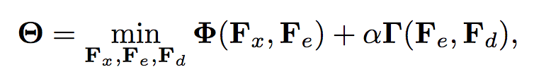
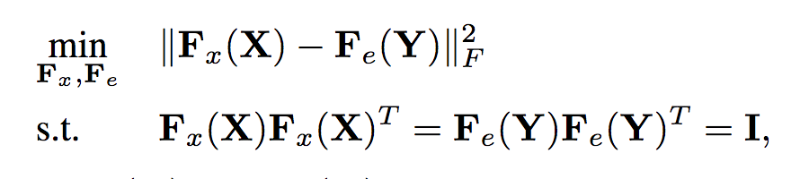
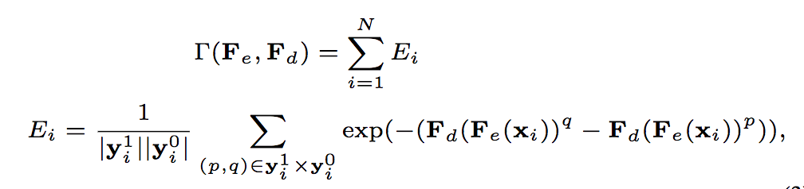

# Learning Deep Latent Spaces for Multi-Label Classification

https://www.aaai.org/ocs/index.php/AAAI/AAAI17/paper/download/14166/14487

# general idea

main components:

1. joint embedding learning for input and label space using Deep CCA (a modified version)
2. decoding from latent space to label space

# formulation

objective function:

- correlation part
- label recovery part

## correlation part

- not exactly the formulation CCA, as covariance is not maximized, but this allows cvx opt methods to be used
- constraint ensures that different latent spaces are un-correlated
- in practice, relaxed using lagrangian relaxation

**claimed** advantage**: feature-aware label embedding learning via joint model (instead of separate one)

however, why joint model is better than separating concerns/modularity?

## label recovery part

maximize the distance between prediction value of positive labels and negative labels

**claimed advantage**: able to enforce the preservation of label co-occurrence information

I don't see how..

# further question

- main question: why the claimed two benefits of two parts in the objective?
- adapting to the extreme multi-label case? as experimented with datasets with moderate size and label space and evaluated with F1 scores only
  - the second part of problem formulation should be rank-related

# learned

- applying (deep) CCA for multi-label classification
- a different formulation of CCA that allows usage of gradient descent

