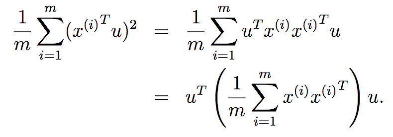

# PCA - principal component analysis

http://cs229.stanford.edu/notes/cs229-notes10.pdf

# motivation

Given veihicle data $`\{x^{(i)} \mid i=1, \ldots, m\}`$ where $`x^{(1)} \in R^n`$, where $`n=2`$, 

among them, $`x^{(i)}_1`$ and $`x^{(i)}_2`$ are max speed miles per hour and max speed kms per hour. 

these two variables are almost *linearly dependent*, how can we detect them and perhaps remove them? 

also, the radio-controlled helicopter example: skills vs enjoy

# formulation

select a unit-length vector $`u`$ so that the projected points of $`\{x^{(i)}\}`$ have the largest variance (intuitively variation).

- why unit-length? to make games fair, an vector with large length certainly beats one vector with small length

(assuming the data is normalized to have zero mean and one std), length of the projection of $`x`$ to $`u`$, $`u^T x`$ corresponds to the variance.
  - or distance of the projected point to the origin
  - (dot product)

and $`\Sigma = \frac{1}{m} \sum_{i=1}^{m}  x^{(i)} {x^{(i)}}^T`$ is the *co-variance matrix*. 

this corresponds to finding the eigen vector with the largest eigen value

[why this?](https://stats.stackexchange.com/questions/10251/what-is-the-objective-function-of-pca/10256#10256)

- exploiting property of 

**finding more vectors**

- $`u_i`$ that explains the the $`i`$th largest variance and is orthogonal to $`u_1, \ldots, u_{i-1}`$

# preprocessing

$`(x - mean) / std`$ so zero mean and 1 standard deviation

# learned

- PCA formulation
- the reason that PCA problem formulation leads to largets eigen values
- this formulation dates back to [Rayleigh quotient](https://en.wikipedia.org/wiki/Rayleigh_quotient)
  - also appeared in spectrail graph theory