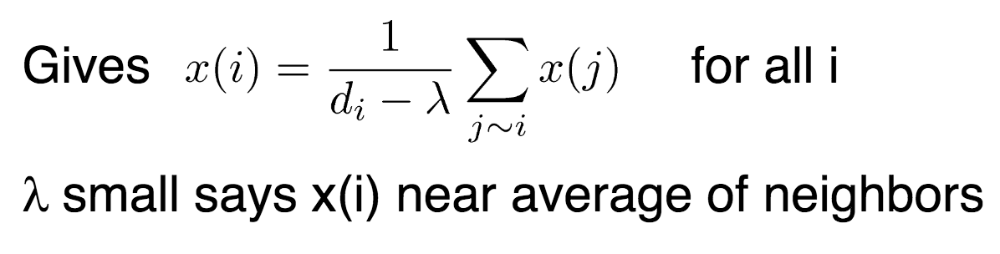

# Spectral Graph Theory and its Applications

based on http://www.cs.yale.edu/homes/spielman/sgta/SpectTut.pdf

- more notes by the same professor: http://www.cs.yale.edu/homes/spielman/561/

# graph Laplcian

1. num. zero eigen values = num. connected components
2. [ ] the smallest non-zero eigen value, `\lambda_2`: *algebraic connectivity of a graph*
  - the further from 0, the more connected.
  - by [Fiedler 73](http://snap.stanford.edu/class/cs224w-readings/fiedler73connectivity.pdf)
  - intuition: consider the case below, the small `\lambda_2` is, the smaller the minimum is, therefore "closer" of nodes

`0 = \lambda_1 \le \lambda_2 \le \lambda_3 \ldots \le \lambda_n`

# spectral drawing

for 1D (embedding onto line), the problem:

`\argmin x^{T} L x`

solution is `x_2` (eigen vector w.r.t `\lambda_2`)

and the objective value is `\lambda_2`

why this? change the max to min in the [post](https://stats.stackexchange.com/questions/10251/what-is-the-objective-function-of-pca/10256#10256)

## Tutte justification

## the case of `\lambda_n`

for larger `\lambda` values, the more separated the graph is. (page 27 for example)

for example `\argmax x^{Y} L x` *separates* neighboring nodes as far as possible

can be applied to 2D case, the solution is `(x_2, x_3)`

some examples in the slides inlcuding [Dodecahedron](https://en.wikipedia.org/wiki/Dodecahedron)

## Courant-Fischer definition of eigvals/vecs

do not understand (page 13)

- why normalize by `x^T x`?
- why `\lambda_k` has `\min \max`?

# Spectral graph coloring

problem: a coloring of a graph is an assignment of one color to every vertex in a graph so that each edge
attaches vertices of different colors. 

[ ] related to spectral graph theory, see [this post](http://www.cs.yale.edu/homes/spielman/561/lect03-15.pdf)

# isomorphism testing

- different eigenvalues -> non-isomorphic (eigval invariant under node relabeling, page 8)
- does it mean same eig values -> isomorphic?

[ ] see [this note](http://www.cs.yale.edu/homes/spielman/561/2009/lect22-09.pdf)

# random walks

BP http://www.cs.yale.edu/homes/spielman/561/2009/lect08-09.pdf

`1-\lambda (n-1)` related to the rate of convergence of lazy random walk

# min-cut

BP http://www.cs.yale.edu/homes/spielman/561/lect06-15.pdf
