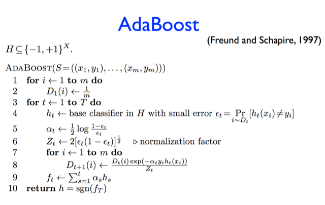
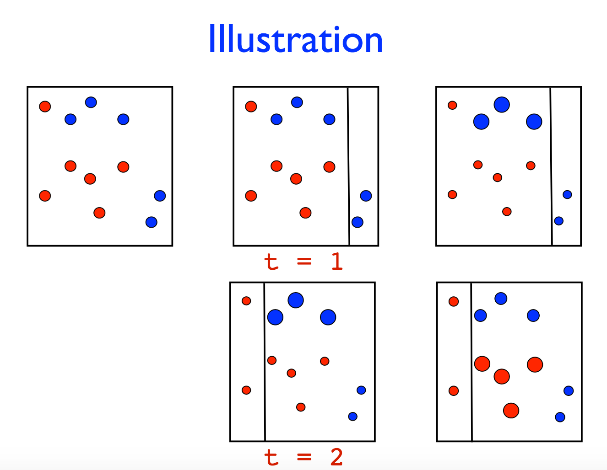
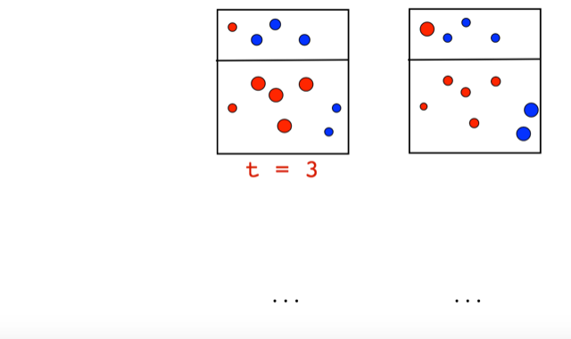
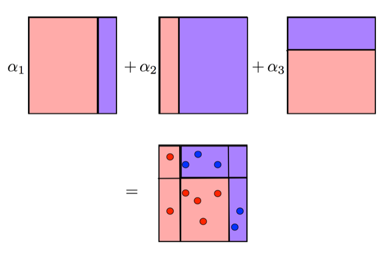

# basic idea

through a weak *learner*, we can learn a series of weak *predictors* and make them into a strong *predictor*.

basic idea: learn a sequence of predictors $`\{h_t\}_{t=1}^T`$ under different data distribution $`D_t`$. meanwhile, each prediction is associated with a weight $`\alpha_t`$

- the higher $`D_t(i)`$, the more important $`i`$th data point is (predictor is more likely to make mistake on it)

specifically, given some learning algorithm:

1. initially, data points are equally important $`D_1(i)=\frac{1}{m}`$ (assuming there are $`m`$ data points)
1. at step $`i`$,  learn a predictor, $`h_t`$, under data distribution $`D_t(i)`$
1. $`D_t(i)`$ (weight on training data points) is **adjusted** based on the current predictor's ($`h_t`$) performance and $`D_{t-1}`$ (in a multiplicatively way, very related to *Multiplicative Weight Update* framework)
1. predictor weight $`\alpha_t`$ computed by how good it predicts under $`D_t`$

final predictor is $`\sum_{i=1}^T \alpha_i h_i`$

algorithm:

from [these slides](http://www.cs.nyu.edu/~mohri/mls/lecture_6.pdf)

# example (using decision tree stump)

# main theoretical result

the learning error drops exponentially. 

# faster to compute $`D_t(i)`$

normalize:

1. $`\sum_{\text{right }i}D_t(i)=1/2`$
2. $`\sum_{\text{wrong }i}D_t(i)=1/2`$

from [MIT opencource](https://www.youtube.com/watch?v=UHBmv7qCey4)