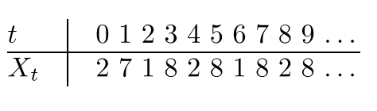

# summary

- uniform random spanning tree (undirected) generation for undirected unweighted graph
- proof of markov matrix tree theorem using backward chain
- backward chain produces random spanning with stationary distribution $`\delta(T) = \prod_{e \in T} w(e)`$
  - $`w(e)`$ is normalized to be stochastic accoding to node degree
- uniform random spanning tree generation using another type of tree by forward chain
  - proof using equivalence to backward chain and chain reversibility

# introduction

## random tree generation algorithm

define a random walk on a graph:

- imagine a particle moving on the vertices on a graph via the edges
- at each time point, it moves from the current vertex to one of its neighbours uniformly randomly

**the algorithm:**

- simulation of a *simple random walk* on a (connected undirected) graph can be used to **uniformaly** generate a random spanning tree

the tree is collected as follows from the random walk:

- for each vertex $`i`$, collect the edge $`\{j, i\}`$ that **first** enters $`i`$
  - why "first"?
- then $`T`$ is the collection of edges

note: 
- a vertex might be visited multiple times
- the tree is **undirected**

## running time

running time: expected cover time of graph $`G`$, $`E(C)`$

- $`O(n^3)`$ worst case
- usually $`O(n logn)`$
  - if the transition probability matrix of the simple random walk has a **second largest eigenvalue bounded away from 1**
  - reference: **BK89**

**the remaining question**: how to prove that the tree is uniformly distributed

# markov chain tree theorem

define a markov chain $`M=X_0, X_1, ...`$ on *directed* graph $`G`$ where:

- state space is $`V`$
- transition matrix is given by the adjacency matrix
- assume it's irreducible (in other words, $`G`$ is *strongly* connected)

the spanning tree $`T`$ on $`G`$:

- all edges in $`T`$ point towards root 
- weight is **product** of edge weight
  - note: egge weight is normalized into probabilities

two sets of spanning trees:

- spanning trees rooted at $`i`$: $`T_i(G)`$
- all spanning trees regardless of root: $`T(G)`$

**markov chain theorem**:

- **the stationary distribution $`\pi(i) = \sum_{T \in T_i(G)} w(T) / \sum_{T \in T} w(T) = \sum_{T \in T_i(G)} \delta(T)`$**
  - $`\delta(T)`$ is the normalized weight of $`T`$
- in other words, stationary distribution on node $`i`$ is proportional to the sum of weights of all spanning trees rooted at $`i`$

what does it tell?

1. the relationship between $`\pi`$ and $`\delta`$, the stationary distribution for random walk chain and back tree chain
   - what does it further tell?
2. stationary distribution of back tree chain: the recursive definition, something like $`\delta(T_i) = \sum \delta(T_j) P(j, i)`$
   - proportional to tree weight
3. what else?

# proof of markov chain tree theorem

some concepts first

## transient  and recurrent states

- transient states: states that can only be visited only
  - example: non-spanning trees
  - transient: lasting only for a short time
- recurrent/persistent states: non-transient states
  - states that can be visited multiple times
  - example: the spanning trees

## backward tree chain

now, we have a **second** chain. 

the chain $`M=X_0, X_1, ...`$ induces another chain, named *backward tree* chain $`B_0, B_1, ...`$.

- backward tree $`B_t`$: a random walk sequence until time $`t`$ defines a directed tree by:
  - $`X_t`$ is the root
  - for the rest visited nodes $`u`$, taking the edge $`(u, v)`$ where $`u`$ is last visited.

example: 

for $`t = 6`$, root is $`X_6=1`$, $`I_6 - \{X_6\} =\{2, 8, 7\}`$, then edges are $`\{(8, 1), (2, 8), (7, 1)\}`$. 

if $`t > C`$ (cover time), then $`B_t`$ is a directed spanning tree of $`G`$ (because all nodes are visited)

note that in this case:

- transient state: non-spanning trees (because they are eventually transit to spanning trees and neve go back(
- recurrent state: spanning trees

denote the stationary distribution of such chain by $`\delta(T)`$

## "connecting" the two chains

what's the relationship between $`\pi(i)`$ and $`\delta(T)`$

by def on $`\pi(i)`$:

- $`\pi(i) = \lim_{N \rightarrow \infty} (1/N \sum_{i=1...N} Pr[X_t=i])`$
  - probability that $`i`$ is visited in the long run
by the induction from $`X_i`$ to $`B_i`$

- $`Pr[X_t=i]`$ equals to $`Pr[B_t \text{ is rooted at } i]`$
- in other words, $`\pi(i) = \sum_{T \in T_i(G)} \delta(T)`$
  - probability that the spanning tree is rooted at $`i`$

**a new question**: what is the form of stationary distribution, $`\delta(T)`$?

## connecting $`\delta(T)`$ to $`w(T)`$

we found $`w=\delta`$. to prove so, we need to show $`w`$ satisfy stationarity. 

by def of stationarity, $`\delta(T) = P \delta(T)`$ should hold, where $`P`$ is the transition matrix. 

next, we eleborate what is exactly $`P`$.

define *precursor* of tree $`T_i`$: another tree *from which* it transits to $`T_i`$.

then what does a precursor of $`T_i`$ look like? denote $`T_k`$ as one precursor, it should satisfy:

- $`i`$ has some parent (because it's not root in $`T_k`$), say $`j`$, in other words, an edge $`(i, j)`$
- precursor's root, say $`k`$, is connected to $`i`$, so the particle can reach from $`k`$ to $`i`$ by edge $`(k, i)`$

the transition probability to arrive at $`T_i`$ can be defined recursively:

- $`\delta(T_i) = \sum_{T_k} \delta(T_k) Pr(k, i)`$ (by def of stationarity)
- note that $`T_k=T_i + (i, j) - (k, i)`$

if we substitue $`\delta`$ by $`w`$, then:

- $`w(T_k)=w(T_i + (i, j) - (k, i))=w(T_i) Pr(i, j) / Pr(k, i)`$
- $`w(T_i) = \sum_{T_k} w(T_i) Pr(i, j) / Pr(k, i) Pr(k, i)`$
  - $`=\sum_{T_k} w(T_i) Pr(i, j)`$
  - $`=\sum_{(i, j)} w(T_i) Pr(i, j)`$
  - $`=w(T_i) \sum_j Pr(i, j)`$
  - $`=w(T_i)`$

note that the index `j` indicates the predecessor. 
- all `\{j \mid (j, i) \in E\}` can be ancestor of `i`

in other words, $`w(T)`$ satisfy the recursive transition probability (also stationary distribution), $`\delta(T)`$.

  - $`\delta=w`$

thus, proof is done.

## implications of the theorem

- the probability of sampling a tree using random walk is proportional to its weight (product of edge weights)
- in other words, the stationary distribution on the spanning tree is characterized by the tree weights

# reversible chais and uniform generation

given the *reversible* random walk chain, define another markov chain called *forward tree chain*

definition: forward tree

- given a random walk chain
- for each vertex, take the vertex and its first entrance into the vertex and reverse the direction
  - example: visiting order of $`2->7->1->8->2->8`$ gives tree, $`(7, 2), (1, 7), (8, 1)`$
  - for 8, 1 is the first entrance

- non-spanning trees: transient states
- each spanning tree: **an absorbing state** (the state does not change any more afterwards by definition of forward tree)

## theorem

for forward tree chain, denote the state at cover time as $`F_C`$, then for any spanning tree $`T`$, 

- $`Pr[F_C=T] = w(T) / \sum_{T^{'}} w(T^{'})`$
- in other words, $`F_C`$ is distributed according to the stionary distribution of **back tree chain**
- or $`\delta_F = \delta_B`$

## proof

using reversibility, given a chain $`X_1, ..., X_k`$ and its reverse $`X_k, ..., X_1`$, they have the same probability of being generated.

$`Pr(X_1, ..., X_k) = Pr(X_k, ..., X_1)`$

denote:

- back tree given the first chain as $`T`$, then 
- forward tree given the second chain is $`T`$ as well

in other words, $`Pr(B_k=T) = Pr(F_k=T)`$

using the definition of stationary distribution, proof is done

example:

- for the node visiting sequence `2, 7, 1, 8, 2, 8, 1, 8, 2, 8`, the forward tree is `(7, 2), (1, 7), (8, 1)`
- if we reverse the sequence, the backward tree is the **same**!

this means, if we run a forward tree chain, it is equivalent to a backward tree chain with some stationary distribution `\delta`. this also says `\delta` is the stationary distribution for the forward chain.

## uniform generation

def of simple random walk on graphs: unweighted graph, e.g, each neighbor has equal probability of being visited.

**corollary**

 let $`M`$ be an simple random walk on $`G`$ starting from $`i`$, and let $`F_C`$ be the forward tree from $`M`$, the $`F_C`$ is uniformly distributed for all spanning trees rooted at $`i`$

proof: 

for a tree rooted at $`i`$, its probability of being generated is $`d_i / \sum_v d_v`$ because for each node `j` in the tree, the edge `(j, i)` has weight $`1/d_j`

note: 

- only equally likely for trees rooted at `i`
- for directed tree

# swap-edge technique

## basic idea

- given some tree $`S_t`$, randomly add an edge $`e`$ in from $`E-S_t`$, and randomly remove an edge $`f`$ from $`S_t`$. 
- if the new tree is $`S_t + {e} - {f}`$ is a tree, update it with $`S_{t+1}`$, otherwise, $`S_{t+1}=S_t`$

## theoretical results

the chain $`{S_t}`$ is mixing rapidly in polynomial time

mixing time is proved using: ergodic flow and second largest eigen value

- further readingf: [mixing time and eigen value](https://math.dartmouth.edu/~pw/math100w13/kale.pdf)

# other topics

- quasi uniform generation for directed graphs
- uniform spanning tree generation using swap technique and proof of it's rapidly mixing

# learned

first:

- the stationary distribution of backward tree generated by random walk
- given the above stationary distribution, how to prove "markov chain tree theorem")

second:

- using GENERATE to generat *uniform* random spanning tree for any *undirected* and *connected* graph
  - undirected and connected ensures reversibility
- proof skeleton for uniform randomness:
  - uses the stationary distribution of backward tree chain
  - reversibility finishes the proof
- ~~theorem 2 should also imply generating random spanning tree by tree weight (product of edge weight)~~
  

third:

- for general directed graph, reversibility does not hold. therefore GENERATE does not give uniform random tree

fourth:

- it works for unweighted graph, weights are assigned to ensure stochasticity.

# questions

- does GENERATE work on undirected and *weighted* graphs?
  - if edge weight is stochastic, then yes
  - what if edge weight is not stochastic? we need to normalize it for the random walk. 
    - does this change the distribution?

- what's the similarity/difference between GENERATE and the coupling-to-past method?
  - GENERATE works for undirected graph on random uniform spanning tree
    - perfect sampling (but only for uniform)
    - automatic stopping
  - coupling-from-past works for directed and weighted graph

- can we use backward tree chain to generate (uniform) random trees?

# relation to random generation of steiner trees

1. tree probability should be related to its weight: the larger the weight, the less likely to be generated
   - what's the probability formula like?
   - $`-exp(w(T))`$
2. we can design two chains? one for random walk, one for tree generation?