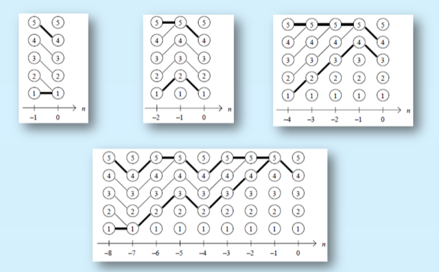
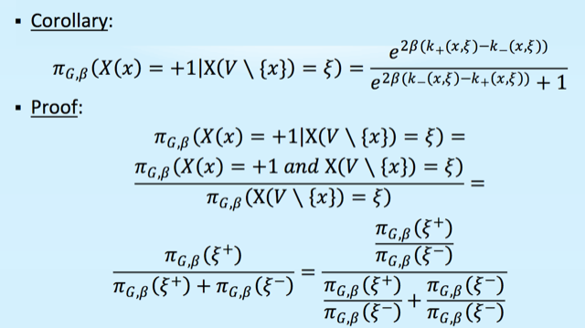

http://www.cs.tau.ac.il/%7Eamnon/Classes/2010-Seminar-Random-Walk/Presentations/Propp-Wilson.pdf

# key idea

define some "ordering" function $`\le`$ (also, $`\ge`$) on state space $`X`$
then, it's obvious there exists some global minimum and maximum according to the ordering.

if we can make sure the state transition *preserves the order*, then we can use sand-wiching techniques to determine coupling. 

in detial, given $`X_t \rightarrow X_{t+1}`$ and $`Y_t \rightarrow Y_{t+1}`$, if $`X_t \le Y_t`$ guarantees $`X_{t+1} \ge Y_{t+1}`$, then we can use $`P^T(X_{min}) = P^T(X_{max})`$ to decide whether the chains couple. 

# ladder example

here $`s`$ is the state, $`U`$ is the random number, $`x`$ is an instiation of $`U`$. 

$`\phi`$ determins the transition matrix. 

for a given time point, $`x`$ is identical for all chains. 

therefore, either $`s_{t+1} \ge s_t`$  or $`s_{t+1} \le s_t`$ for all chains.

# ising model example

given a graph $`G=(V, E)`$, each node $`v`$ picks a value from $`\{-1, 1\}`$, so the variable is $`\xi \in \{-1, 1\}^{|V|}`$. 

the markov chain:

1. randomly choose a node $`v \in V`$
2. randomly choose the value according to **conditional distribution** (what is the form?)

the cond proba

define the ordering to be $`\xi \le \eta`$ if for all $`v \in V`$, $`\xi(v) \le \eta(v)`$. 

then $`\xi_{max}`$ is all +1 and $`\xi_{min}`$ is all -1

next, we show

given $`\xi_{t}`$ and $`\eta_t`$ where $`\xi_{t} \le \eta_t`$, after one transition, 
$`\xi_t \rightarrow \xi_{t+1}`$ and $`\eta_t \rightarrow \eta_{t+1}`$. 

it satisfies that $`\xi_{t+1} \le \eta_{t+1}`$

intrepretation: 

given $`X_t, Y_t`$ where $`X_t \le Y_t`$, to prove sandwiching is appliable, we need to show if $`X_{t+1}`$ "goes up" (by the order), then $`Y_{t+1}`$ must goes up (so that $`Y_{t+1} \ge X_{t+1}`$. 

# how to design sandwiching

define 1) transition probability and 2) ordering function so that:

1. 1) prserves 2) 
2. 2) gives max and min