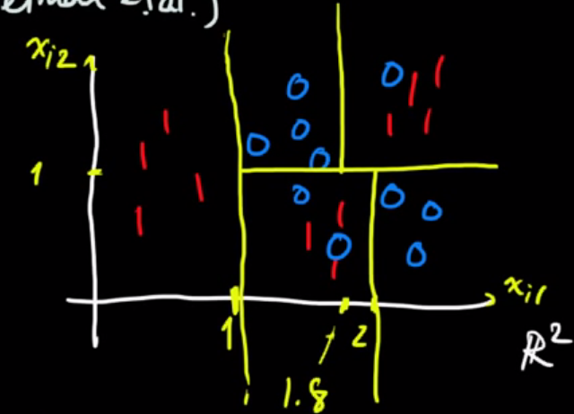
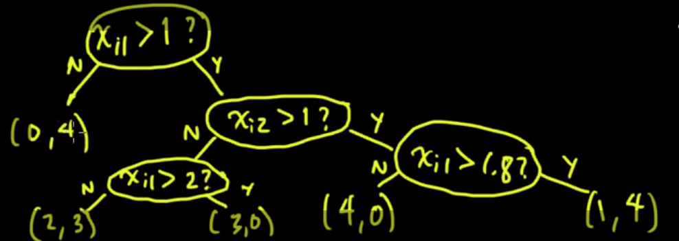
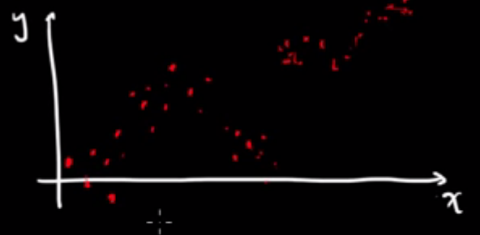
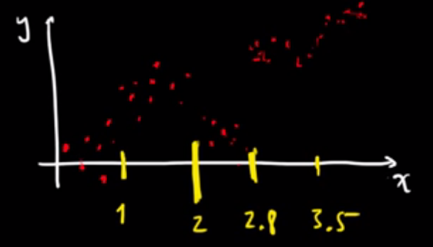
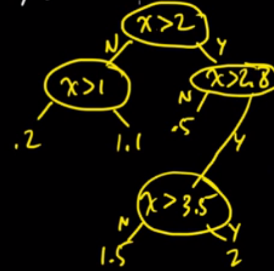

# for classificaiton

[video](https://www.youtube.com/watch?v=p17C9q2M00Q)

basic idea: 

- parition the space into regions like this

internally, its a tree structure

- each leaf represents a region
- prediction is made by going down the tree by evaluating the decision rules and label it by majority voting

# for regression

suppose given a set of 1d points, $`(x_1, y_1), \ldots, (x_n, y_n)`$, where $`x_i, y_i \in \mathbb{R}`$

like the following:

then we have selected the split points (on real domain)

and build a tree that minimizes the training error:

training error is meaured at each **leaf node** as:

$`\sum_i (y_i - \hat{y})^2`$

# growing regression tree

greedily and recursively split the data points into subset of points (regions).

suppose training data points $`(x_1, y_1), \ldots, (x_n, y_n)`$, where $`x_i \in \mathbb{R}^d, y_i \in R`$

then at each step, we select a dimension $`j \in \{1, \ldots, d\}`$ and $`s \in \mathbb{R}`$ such the following is **minimized**:

$`\text{min}_y \sum\limits_{i: x_{ij} < s} (y_i - y)^2 + \text{min}_y \sum\limits_{i: x_{ij} \ge s} (y_i - y)^2`$

in other words, we minimize the square loss at **each** region. 

then, we do this recursively at each partition.

## issue: when to stop growing?

more than one ideas, for example:

1. avoid growing the tree when region is only one or less than some number

# growing classification tree

similarly, we need to define a error function.

intuitivel, given a region/partition $`R`$, the error is the fraction of nodes that are misclassified by majority voiting

$`E_R = \min_y \frac{1}{N_R} \sum_{i \in R} {\text{1}(y \neq y_i)}`$ (assuming it's binary classification)

then the splitting is done by searching dim $`j \in \{1,\ldots,d \}`$ and value $`s \in R`$

in other words, we choose $`j`$ an $`s`$ that minimizes:

$`N_{R(j,s)} E_{R(j,s)} + N_{R^{'}(j,s)} E_{R^{'}(j,s)}`$

$`R`$ and $`R^{'}`$ are the regions that are split by $`y`$ and $`s`$

namely, **inpurity** measure

## other measures

1. entropy: `- \sum_i p_i \log p_i`
2. gini index: `1 - \sum_i p_i^2`

tends to perform better than misclassification rate ([example](https://github.com/rasbt/python-machine-learning-book/blob/master/faq/decision-tree-binary.md))

# issues

1. feature data type
2. error cost matrix
3. missing value
   - one way: surrogate variable (replace it withd default?)
4. sensitive to data (instability): one data point change might lead to a totally different tree

# bootstrap aggregation (bagging)

https://www.youtube.com/watch?v=5Lu1eTiX7qM

