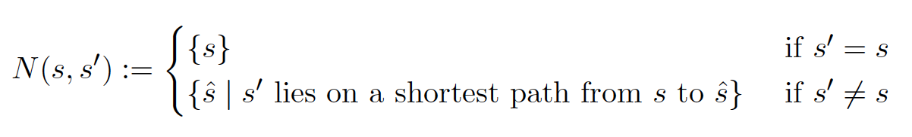
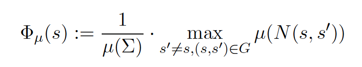
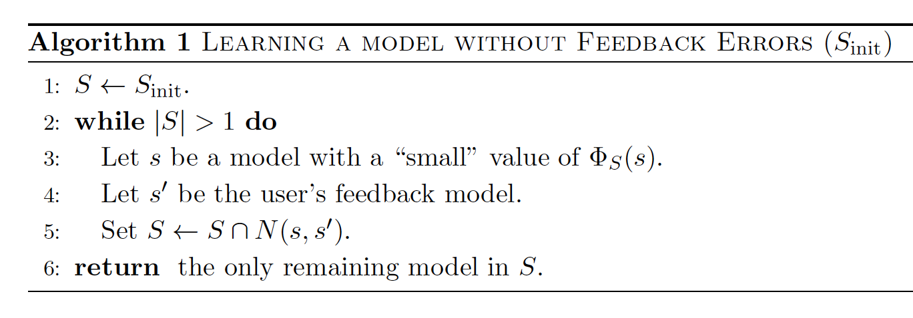
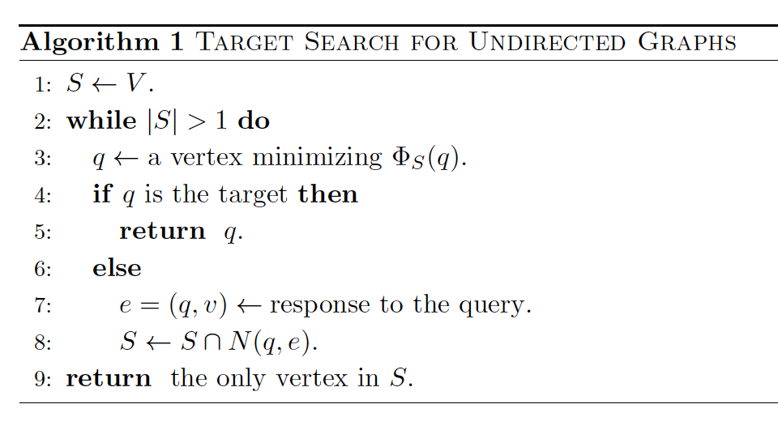

# A General Framework for Robust Interactive Learning

# goal

learn the correct model using as few queries as possible

# model

query and feedback

- $`s \in \Sigma`$: $`\Sigma`$ are all models
- $`s^{*}`$: the ground-truth model
- feedback $`s^{'}`$: another model more similar to the $`s^{*}`$ than current model $`s`$

- $`n`$: input size, number of items to rank, number of sample points to classify, etc
- $`N`$: number of models (the number of vertices in the model graph, defined below)

the algorithm selects a model $`s`$ to query and is provided *correct* feedback with probability $`p`$:

- if $`s=s^{*}`$, then the algorithm is told it's the true model
- otherwise, it's told a model $`s^{'}`$ that is more similar to $`s`$
  - in the case of binary graph search,$`s^{'}`$ is the neighbor of $`s`$ that lies on the s-t path between $`s`$ and $`s^{*}`$

## model graph

- node $`s`$: a model
- edge $`(s, s^{'})`$:  if a user can provide feedback $`s^{'}`$ w.r.t $`s`$
  - edge weight: how to choose the weight is important
  - also how to interpret it

constraint:

- every correct user feedback $`s^{'}`$ lies on a shortest path from $`s`$ to $`s^{*}`$ in $`G`$ with respect to the lengths $`w_e`$

# notations

- $`N(s, s^{'})`$: set of consistent models $`\hat{s}`$ s.t $`s^{'}`$ lies on the s-t path between $`s`$ and $`\hat{s}`$
  - to recap why: consider binary graph search

- $`\mu(s)`$: node weight or likelihood (to be $`s^{*}`$)
  - $`\mu(S)`$: summation of weights of nodes $`S`$
  - $`p=1`$, then node weight is either zero or non-zero

- $`\phi`$: largest possible fraction of consistent models (in the worst case)

- $`\mu_S`$: likelihood function that assigns $`\mu_s=1`$ for all $`s \in S`$ and $`\mu_{s^{'}}=0`$ for $`s^{'} \not\in S`$
- $`\phi_S(s)`$: when node weights are $`\mu_S`$ 

# main theorem

- Theorem 2.2 for non-noisy case
- Theorem 2.4 for noisy case

## Proposition 2.1

intrepretation: there always exists a query s.t. it can reduce fraction of consistent models to *at most* 1/2

this is important for proving query complexity

## Theorem 2.6: on sampling oracle

- $`G`$ is the model graph

requires bounding the maximum degree and diameter
- however, since the graph can be  exponentially large, how to bound it?

requires two polynomial algorithms:

1. one that can return a model drawn from distrbution $`\mu^{'}`$ which is an approximation of  $`\mu`$, where $`d_{TV}(\mu, \mu^{\}) \le \Delta`$
   - for the case of $`p=1`$, the algorithm should return a uniform sample
2. given some model $`s`$, an algorithm that can decide if $`s`$ is consistent with the query response or not

the result: 

- the algorithm can find a model/query $`s`$ with $`\phi_\mu(s) \le \frac{1}{2}  + 2\Delta + \epsilon`$ (with high probability)

# noisy-free version

- "small": ideally, choose the smallest one, but efficient computaton can be an issue

in comparison to 

which is a special case of the previous version. 

# computational efficiency

refer to:

- Theorem 2.6 
- Algorithm 4 for a local search algorithm to find query/median node

# application I: ranking

- *equivalence query*: the user must be presented with a complete model, and the feedback will be a mistake if there exists
  - the model can be a classifier (the predicted labels on the sample points) or a ranked list of all the items to rank
  - proposed by Dana Angluin

## Adjacent Transpositions

algorihtm presents a ordering, user gives an incorrectly-ordered pair. 
- conceptually similar to bubble sort (swapping pairs)

the graph:

- $`n!`$ nodes, one for a permutation
- an edge between $`\pi`$ and $`\pi^{'}`$ if they can be obtained from each other by swapping a pair
  - edge weight: [kendall $`\tau`$ distance](https://en.wikipedia.org/wiki/Kendall_tau_distance), which counts the number of inconsistent pairs from two list. It can be normalized to $`[0, 1]`$

shown: 

- it matches the graph definition

main theorems:

- Corollary 3.2: it takes $`n\log(n)`$ queries, non-noisy case,  ($`\log(n!) \le n \log(n)`$), where $`n`$ is the number of items
- Theorem 3.3: worst case still requries $`n\log(n)`$ queries

efficiency:

- naive implementation is inefficient:
  - addressed in Section 3.3

## Implicit feedback

a use checks the list from high rank to low and may skip items before clicking one

- feedback is the click
- conceptually similar to Insertion Sort (the clicked item should be inserted before the skipped ones)
- bubble sort is a special case of insertion sort where only one item is skipped

graph:

- same set of nodes as prev case
- an edge from $`\mu`$ to $`\mu_{j \leftarrow i}`$, where $`\mu_{j \leftarrow i}`$ means moving $`i`$ before $`j`$ (assuming $`i`$ appears *after* $`i`$)

same query complexity

## computation issues

# questions

- what's the focus of this paper? query strategy or learning the model or both?
- how to interpret the "shortest path" in different settings? classification, ranking, etc

