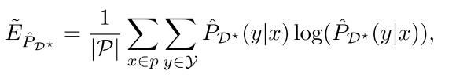

# Toward Optimal Active Learning through Monte Carlo Estimation of Error Reduction

goal: query selection based on error reduction directly.

anyway, error reduction is our final goal

# related active learning methods

- uncertainty-based
  - disadvantage: might have selected an outlier,
- version space based
  - usually reducing version space which has no effect on error rate

# loss function

reduce expected error of learner

however, true labels are not avaible

it uses the learner to approximate (counter-intuitive)

# query strategy

select the `x` that after adding it, the empirical log-loss is minimized. 

# learned

- non-entropy based method, more direct
  - though not well-explained on why using learner to approximate true label
