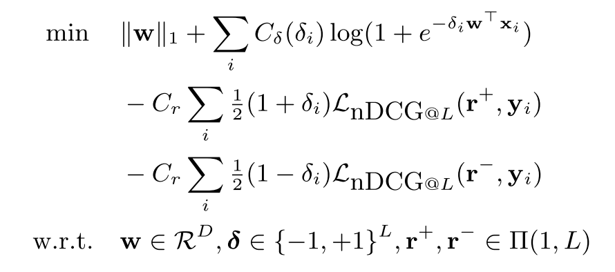

# FastXML: A Fast, Accurate and Stable Tree-classifier for eXtreme Multi-label Learning

main point:

- node partition objective using  nDCG
- optimization method

# common methods

- train: partition the nodes recursively until each leaf contains only a small number of labels
- test: pass the data point down to some leaf

# overview

goal

- fast to train 
  - why MLRF/LPSR is slow to train? 
- good prediction accuracy

novelty:

- faster to train using a different node partition method
- optimizes nDGC loss function
  - compared to [Gini index](https://en.wikipedia.org/wiki/Decision_tree_learning#Gini_impurity)

# detail

partition over feature space (like kd-trees)

## node partition

- goal: split the nodes at the current node into two disjoint sets as the left/right trees
- method: learn a linear separator

objective:

note that:

three variables:

- $`\delta`$: the "side" label, +1 for one, -1 for the other
- $`w`$: linear separator weight
- $`r^{+}`$ and $`r^{-}`$: predicted label at each side (using accumulated information)

- the first term enforces sparsity, making it faster at prediction
- the second term is like logistic regression loss
  - $`\delta`$ and $`w`$ are coupled, $`\delta`$ is like the binary label
- third and fourth term are related to nDCG loss
  - it's @L level, not @k. so it considers all labels

optimization:

- optimize $`r`$ by fixing $`w`$ and $`\delta`$: easy 
- optimize $`\delta`$ by fixing $`w`$ and  $`r`$: need $`\delta`$ to stabilize
- update $`w`$ by fixing $`r`$ and $`\delta`$: on only logistic loss, ignoring the nDCG part

if $`\delta`$ does not change any more, terminate.

## theorem

convergence within finite number of steps

proof idea: $`\delta`$ at different steps will never repeat. 

and there are finite number values for $`\delta`$. 

# learned

- one objective for node partition
- time complexity analysis relies on feature sparsity ($`\hat{D}`$) and label sparsity ($`\log L`$)

# what's next

- two other methods: LPSR and MLRF
- build a distributed version of this algorithm using spark, etc

