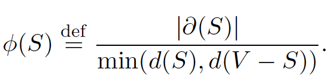
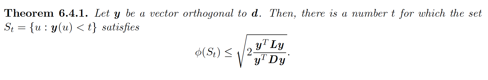

# Conductance, the Normalized Laplacian, and Cheeger’s Inequality

http://www.cs.yale.edu/homes/spielman/561/lect06-15.pdf

# conductance

similar to isoperimetric ratio, conductance operates on degrees,  defined as

the conductance of graph $`\phi_G`$ is defined as $`\min_S \phi(S)`$

correspondingly, conductance relies on notion of *normalized laplacian*.

$`N=D^{-1/2} L D^{-1/2}`$

# Cheeger inequality

intrepretation: the graph conductance upper bounded by $`\sqrt{2 v_2}`$, where $`v_2`$ is the second smallest eigen value of $`N`$

in other words, $`\phi_G < \sqrt{2 v_2}`$ 