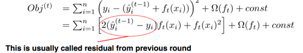
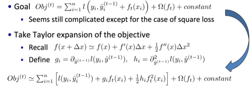
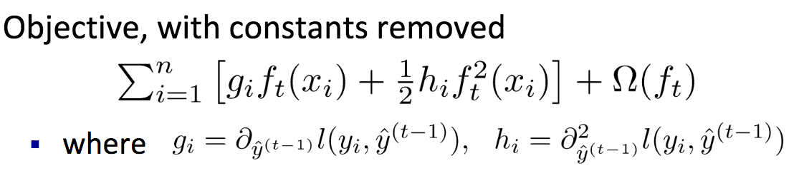
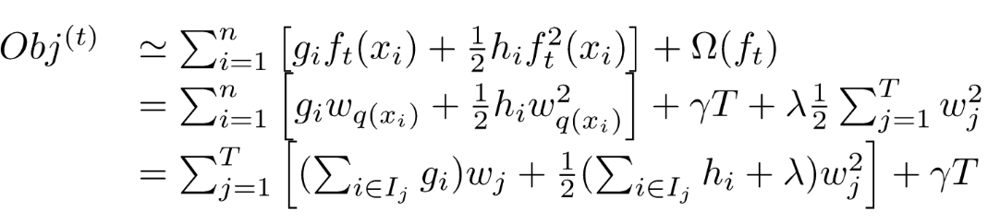
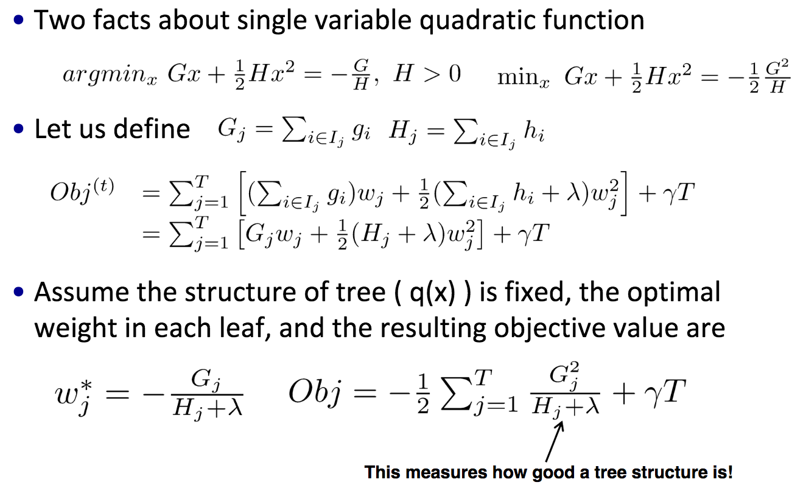

# introduction

https://homes.cs.washington.edu/~tqchen/pdf/BoostedTree.pdf

we focus on regression trees: $`\mathbb{R}^T \rightarrow \mathbb{R}`$

# key elements of supervised machine learning

- model: e.g, 
  - linear regression
  - logistic regression: $`\frac{1}{1+e^{-\hat{y}}}`$ (for binary classification)

- parameters: $`\Theta`$, things we learn from data

- objective function: $`L(\Theta) + \Omega(\Theta)`$
  - $`L`$: training loss function, square/logistic/hinge loss
  - $`\Omega`$: regularization, $`l1`$, $`l2`$ norm, controls the complexity of models

- minimize **bias**: minimizing $`L`$ gives better fitting of training data, which is hopefully close the underlying (true) distribution
  - reminds me of *unbiased* estimator

- minimize **variance**: minimizing $`\Omega`$ gives simpler model, which has lower variance for prediction (or more stable)

logistic loss (two forms depending on space of $`y`$)

- if $`y \in \{-1, 1\}`$, then $`\log (1 + e^{-y f(x)})`$
- if $`y \in \{0, 1\}`$, then $`y \log (1+e^{-\hat{y}}) + (1-y) \log (1+e^{\hat{y}})`$

## examples

- ridge regression: $`\sum\limits_{i=1}^{n} ||y_i - w^Tx_i||^2 + \lambda ||w||^2`$
  - linear model, square loss, $`l2`$ regularization
- lasso regression: $`\sum\limits_{i=1}^{n} ||y_i - w^Tx_i||^2 + \lambda |w|`$
  - linear model, square loss, $`l1`$ regularization
- logistic regression: $`\sum\limits_{i=1}^{n} L_{logreg}(y_i, w^Tx_i) + \lambda ||w||^2`$
  - linear model, logistic loss, $`l2`$ regularization

# tree ensemble methods

advantages:

- invariant to scaling of inputs, no need to feature normalization
- learn higher order interactions between features (path in the tree)
  - for example, $`(is-male) and (age < 15) and (has-a-computer)`$ (3rd-order interaction)	

## in context of model and parameters

Model:

$`\hat{y} = \sum\limits_{k=1}^{K} f_k(x)`$

- $`f_k`$ is the regression tree
- another perspective: $`f_k`$ is a function that takes in attributes and outputs score

Parameters: $`\Theta=\{f_1, \ldots, f_K\}, f_i \in \mathcal{F}`$, $`\mathcal{F}`$ all regression trees (function space)

## bias and variance perspective

model: $`\hat{y} = \sum\limits_{k=1}^{K} f_k(x)`$

objective: $`\sum\limits_{i=1}^{n} l(y_i, \hat{y_i}) + \sum\limits_{k=1}^K \Omega(f_k)`$

common heuristics used for decision tree and correspondence to objective:

- split by information gain -- training loss $`\sum_i l(y_i, \hat{y_i})`$
- pruning: regularization defined by number of tree nodes
- max depth: constraint of size of $`\mathcal{F}`$
- smoothing on leaf values: $`l2`$ regularization on leaf values

in other words, *loss+regularization formula* applies to tree/function learning as well. 

# additive training (boosting)

[related to adaboost](../august/boosting.md)

idea: learn a list of predictors sequentially, each each predictor is learned such that the **residual** from previous rounds is minimized. 

notations:

- $`f_t(x_i)`$: $`t`$th predicion on $`i`$th example
- $`\hat{y}^{t}_i=\sum\limits_{i=1}^{t} f_{t}(x_1)`$:  accumulated prediction on $`i`$th exmaple  from previous $`t`$ rounds
- in other words, $`\hat{y}^{t}_i = \hat{y}^{t-1}_i + f_t(x_i)`$

## goal

minimize the error at step $`i`$ :

$`\sum\limits_{i=1}^n l\left(y_i , \hat{y}^{(t-1)}_i + f_t(x_i) \right) + \Omega(f_t) + constant`$

if considering square loss:

the minimizing the above objective reduces the residual while being regularized. 

- if $`2(\hat{y}_i^{(t-1)} - y_i)>0`$, then $`f_t(x_i)`$ should be *smaller* than $`0`$ (this reduces residual), and $`f_t(x_i)^2`$ is like regularization which prevent it from being too small
- similarly, if $`2(\hat{y}_i^{(t-1)} - y_i)<0`$, then $`f_t(x_i)`$ should be larger than $`0`$, and $`f_t(x_i)^2`$ is like regularization which prevent it from being too large

## taylor expansion of loss

note that for square loss, the above is easy to solve. however, for other functions, this might not be so.  

to get a simpler form to optimize, that is why use taylor expansion. 

note:

- $`f(x + \Delta x)`$ corresponds to $`l(y_i, \hat{y}^{(t-1)}_i + f_t(x_i))`$
  - $`x \rightarrow \hat{y}^{(t-1)}_i `$
  - $`\Delta x \rightarrow f_t(x_i)`$

## new objective

benefits:

- theoretical aspect: the optimization problem is explicit (we know what we are optimizing)
- engineering aspect: separation of objective and loss function because objective only depends on $`g_i`$ and $`h_i`$. 
  - we can implement on template of objective, in where placeholders for $`g_i`$ and $`h_i`$ are implemented in a modularized way

# redefinition

## tree function

define a tree $`f_t`$ by the structure $`q`$ and leaf weight $`w`$

- tree structure $`q: \mathbb{R}^d \rightarrow \{1, 2, \ldots, T\}`$
  - maps input $`x \in \mathbb{R}^d`$ to one of the $`T`$ leafs
- leaf weight $`w \in \mathbb{R}^T \rightarrow \mathbb{R}`$
  - map tree leaf index to a real-valued score

then $`f_t(x) = w_{q(x)}`$

## complexity

define complexity (just one of many ways):

$`\Omega(f_t) = \gamma T + \frac{1}{2} \lambda \sum\limits_{j=1}^T w_j^2`$

- number of leafs + $`l2`$ regularization on leaf weights

## objective

if we use $`f_t(x_i) = w_{q(x_i)}`$, and we group the data instances by the leaf the belong to, $`I_j=\{i \mid q(x_i)=j\}`$, points that belongs to the $`j`$th leave.

then we can group the inner parts by the leaf they belong to:

and they are $`T`$ *independent quadratic functions*

# algorithm

## finding tree weight $`w`$

(if we assume tree structure $`q`$ is fixed)

the above re-grouping suggests:

- each quadratic function can be solved separately
- and for each leaf's weight $`w_j`$, it has closed form optimal solution (because it's quadratic)

(recall that $`g_i`$ and $`h_i`$ are just 1st and 2nd order partial derivative of $`l(y_i, \hat{y}_i)`$)

in other words, given any tree structure, we can calculate its optimal objective using the above formula. 

## finding tree structure $`q`$

one practical approach: (recursive) greedy split

a split defines $`G_L, H_L, G_R \text{ and } H_R`$

deciding the best splitting point:

1. for each feature, sort instances by feature values
2. linear scan on the values to decide the best split for that feature
3. take the best split among all features

time complexity:

1. $`O(nd K \log n)`$: 
   - $`O(d n \log n)`$ to sort $`d`$ features (dominated linear scan $`O(nd)`$)
   - tree depth $`K`$
2. approximating/caching sorted features can be applied to further scale up

# misc

- categorical values: convery to one-hot encoding (resulting in sparse features)
- pre-stopping: if stop split gives negative gain, stop (maybe miopic)
- post-pruning: grow tree to maximum depth, recursively prune all splits with negative gain
- another way: $`\hat{y}_i^{(t)}=\hat{y}_i^{(t-1)} + \epsilon f_t(x_i)`$
  - $`\epsilon`$ calle step-size or shrinkage
  - helps prevent overfitting: we do not do full optimization in each step and reserve chance for future rounds

# questions

- how to do classification?

## example: 

http://blog.kaggle.com/2017/01/23/a-kaggle-master-explains-gradient-boosting/