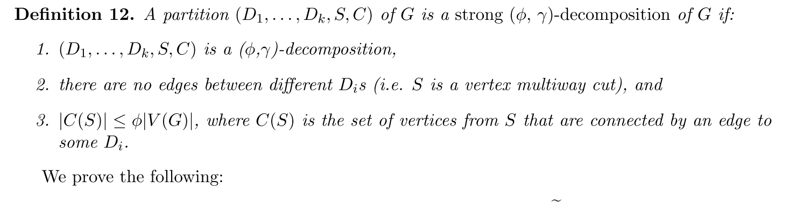

# overview: Faster generation of random spanning trees

a faster random spanning arborescence generation method:

1. short cutting random walks from broder's algorithm
   - short cut is enabled by decomposing grpah into small components, each with fast cover time
2. bottleneck is computing the "shortcutting" probability $`P_v(e)`$
3. bottleneck addressed by computing a slightly different random walk and using the concept strong decoposition
   - shortcomings (missing edges) resolved by sampling trees from the super graph (much smaller)

# intutition

think of broder's algorithm, 

- $`\Delta(mn)`$: edges in random walk, essentially cover time
- $`O(n)`$: edges used to construct the tree

this comparison indicates a lot of waste of edges. 

in practice, some regions are covered very quickly, and a lot of time are spent on them. how we avoid this?

one option is to **shortcut** the random walk, so that the easily covered regions are skipped once they are covered

## concepts

$`\delta`$-random spanning tree: random spanning tree from distribution within multiplicative $`(1+\delta)`$ of uniform. 

- multiplicative $`(1+\delta)`$ of uniform: $`(1-\delta) / N \ge \text{Pr}(T) \le (1+\delta) / N`$

# basic idea

1. identify subgraphs $`D_i, \ldots, D_k`$ s.t. each $`D_i`$ has relatively small cover time inside itself. 
2. based on the subgraphs, identify the cross edges $`C`$ that connect them, $`|C|`$ is much smaller
3. then, when we run the markov chain $`X`$, if subgraph $`D_i`$ is covered, then we shortcut $`X`$ by removing all trajectories of $`X`$ inside $`D_i`$
   - so that it directly transits to other subgraphs without staying inside $`D_i`$?

# $`(\phi, \gamma)`$-decomposition

$`(D_1, \ldots, D_k, S, C)`$

- $`D_1, \ldots, D_K`$: subgraphs
- $`S`$: remaining nodes, $`V \setminus \cup_i V(D_i)`$
- $`C`$: remaining and crossing edges w.r.t $`D_i`$
- $`C(D_i)`$: edges in $`C`$ incident to $`D_i`$
- $`U(D_i)`$: nodes in $`D_i`$ that are incident to some edge in $`C`$

comment:

1. make sure that number of cut-edges are small so that the super graph is sparse
2. makes sure each $`D_i`$ can be covered quickly by upper-bounding the diameter
   - can use the result by Aleliunas that the cover time is at most $`O(|E|\gamma)`$, where $`\gamma`$ is the diameter
3. $`D_i`$ is "denser" compared to $`C(D_i)`$
   - useful for proof of lemma 6 (let's see)

## properties

denote $`\tau`$ as the cover time, then 

**Fact 4**: $`E[\tau]=O(mn)`$, 

because $`\gamma \le n`$, using Aleliunas' result. 

denote:

-  $`Z`$: \#times that $`X`$ visits some edge in $`C`$
-  $`Z_i`$: \#times that $`X`$ visits some edge in $`E(D_i)`$

so $`\tau=\sum_i Z_i + Z`$

**Fact 5**: $`E[Z]=O(\phi mn)`$

- $`\tau_i`$: first time when we reach some node in $`U(D_i)`$ after $`D_i`$ is covered
- $`Z_i^{*}`$: \#times some edge in $`D_i`$ are traversed *until* $`D_i`$ is covered
  - equivalent to: the minimum edge traversal time in $`D_i`$ required to cover $`D_i`$

**lemma 6**:

$`E[Z_i^{*}]=O(|E(D_i) \gamma(D_i)|)`$

similar to Aleliunas' result but proof is different. because $`X`$ is short-cut. 

# algorithm

after $`\tau_i`$, the steps inside $`D_i`$ is useless. 

for example, after $`\tau_i=j`$, $`k`$ steps are spent inside $`D_i`$, $`X_j, \ldots, X_{j+k}`$ and the chain leaves via edge some $`(u, u^{'}) \in C(D_i)`$. 

which means, after $`\tau_i`$, once we have entered $`D_i`$ through $`v`$, we can shortcut the $`X_j, \ldots, X_{j+k}`$ and immediately leave by some edge $`e \in C(D_i)`$, the question is how to compute:

$`\text{Pr}_v(e)`$

the probabiliy of leaving via edge $`e`$ if entering $`D_i`$ via $`v`$. 

denote the new chain as $`\tilde{X}`$

**lemma 7**: if we know $`P_v(e)`$, then it takes $`O(\phi mn)`$ to pre-process $`\tilde{X}`$ and $`O(l)`$ to process a chain $`\tilde{X}`$ of length $`l`$

proof idea: $`e`$ can be sampled in polynomial time. and it takes $`O(|V(D_i)||C(D_i)|)`$ to build the same table. $`|C(D_i)| \le \phi m`$ and $`|V(D_i)| \le n`$

**lemma 8**: given $`(\phi, \gamma)`$ decomposition and $`P_v(e)`$, we can find a random arborescence in $`O(m(\gamma + \phi n))`$ time. 

time decomposes into two parts:

- $`m\gamma`$: sum of cover time inside each $`D_i`$ (lemma 6)
- $`\phi mn`$: by fact 5

## computing $`P_v(e)`$

**lemma 9** we can compute an $`(1+\epsilon)`$-approximation of $`P_v(e)`$ in $`O(\phi m^2 \log 1/\epsilon)`$ time

basic idea: connection between random walk and eletrical network. 

consider the edge we leave through, $`e=(u, u^{'})`$, construct graph $`D^{'}`$ such that:

- add $`u^{'}`$ to $`D`$
- a dummy node $`u^{*}`$ is added to $`D`$ (to replace $`(*, w^{'}) \in C(D)`$)
- connect adjacent edges $`(w, *) \in C(D)`$ to the dummy node $`u^{*}`$
  - like "rewiring" the adjacent edges to point to the same dummy node that we should not touch before touching $`u^{'}`$

then $`P_v(u, u^{'})`$ is the proba of random walk starting on $`v`$ that hits $`u^{'}`$ before $`u^{*}`$

**some magic behind**: $`P_v(e)`$ is equal to the voltage on $`v`$ if we set $`vol(u^{'})=1`$ and $`vol(u^{*})=0`$. this solves $`P_v(e)`$ for one $`e`$ and all $`v \in D_i`$. 

weird that **node** voltage equals **edge** probability. 

solving this approximately uses $`O(|E(D^{'})|\log 1/\epsilon)`$ time. 

we have $`C`$ edges and $`k`$ $`D_i`$s:

- each $`D_i`$ takes $`O(|C||E(D^{'})|\log 1/\epsilon)`$ for $`|C|`$ edges
- so total time is $`O(\sum_i |C||E(D_i^{'})|\log 1/\epsilon)=O(\phi m^2 \log 1/\epsilon)`$

note that $`|E(D^{'})|=|E(D)| + |C(D)| \le 2|E(D)|`$ (using **property 3** of the decomposition)

**lemma 10** given $`(\phi, \gamma)`$ decomposition and $`(1+\epsilon)`$-approximation of $`P_r(e)`$, we can generate a $`\delta`$-random arborescence in time $`O(m(\gamma + \phi n))`$ in expectation, where $`\epsilon \le \delta / mn`$

the distortion is at most $`(1+\epsilon)^{mn} \le 1+\epsilon mn \le 1 + \delta`$

## finding decomposition quickly

ball-growing technique in Leighton and Rao [15]: there exists a $`(\phi, O(1/\phi))`$ decomposition using time $`O(m)`$

## total running time: $`O(m^2/\sqrt{n} \log 1/\delta)`$

3 parts:

1. decompostion: $`O(m)`$
2. computing $`P_v(e)`$: $`O(\phi m^2 \log 1/\delta)`$ (**bottle neck**)
3. finding arborescence: $`O(m(\gamma + \phi n))`$

if we set $`\phi=1/n^{1/2}`$, then running time is $`O(m^2/\sqrt{n} \log 1/\delta)`$

# improving to $`O(m\sqrt{n} \log 1/\delta)`$ time

now we speed up the bottle neck part, computing $`P_v(e)`$

intuition, let's decompose such running time:

- $`\phi m`$: $`|C|`$ term
- $`m \log 1/\epsilon`$: computing the electric voltage for each $`D_i`$, takes $`\sum_i |E(D_i)| \log 1/\epsilon`$ time

if we can replace the $`|E(D_i)|`$ term by $`|V(D_i)|`$, then $`m \log 1/\epsilon`$ becomes $`n \log 1/\epsilon`$, thus giving the above improved time. 

recall that can $`P_v(e)`$ is the proba of starting at $`v`$ and leaving via *edge* $`e`$. in the new running time, it indicates we leave at some *vertex* $`u`$.

therefore $`P_v(e) \rightarrow Q_v(u)`$. 

now we calculate the probability that random walks starts from $`v \in D_i`$, leaves $`D_i`$ and first reaches $`u \not\in D_i`$. 

denote the new chain as $`\hat{X}`$, which is similar to $`\tilde{X}`$ but instead of taking the first and last vertex in $`D_i`$, $`\hat{X}`$ only takes the first. 

the **problem** for $`\hat{X}`$ is: compared to $`P_v(e)`$ we don't know which edge we leave through, which can be the edge that are in the final arborescence. so $`Q_v(u)`$ might miss some edges

to **solve** this we need to:

- make sure missing edges are few
- find a way to recompute the missing edges without distorting the desired distribution

## strong $`(\phi, \gamma)`$-decomposition

1. it's a $`(\phi, \gamma)`$-decomposition, but with more constraints
2. $`S`$ is vertex multi-cut: removing $`S`$ will leave $`D_i`$s as disconnected components
3. nodes in $`S`$ adjacent to $`D_i`$ is bounded
   - note that some $`s \in S`$ might not be adjacent to any $`D_i`$
   - in parellel with $`|C| \le \phi|E(G)|`$ in the def of (weak) decomposition
   - used in $`Q_v(u)`$ time complexity analysis (lemma 14)

**lemma 13**: such decomposition can be computed in $`O(m)`$ time

algorithm in table 1. details omitted

## computing $`Q_v(u)`$

**lemma 14**: given a strong $`(\phi, \gamma)`$-decomposition, we can compute $`(1+\epsilon)`$-approximation of $`Q_v(u)`$ in $`O(\phi m n \log 1/\epsilon)`$ time. 

similar to computing $`P_v(e)`$ using electrical flow. 

now we compute for adjacent nodes $`C(S)`$, not adjacent edges $`C`$. and using property 3, we know $`|C(S)| \le \phi |V(G)| = \phi n`$. 

## coping with shortcomings of $`\hat{X}`$

shortcomming: missing edge due to $`\hat{X}`$

approach: 

1. construct a new graph $`H^{'}`$ where nodes are the disconncted components left by the halfly constructed arborescence (the size is bounded by $`\phi |V|`$, much smaller)
2. use some other random spanning tree algorithm on $`H^{'}`$ (time $`O((\phi n)^{2.376})`$

# what's next

1. electrical network and random walk
2. ball growing techniques
