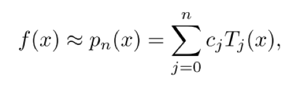

# overview

estimate log-determinant of large positive definite matrix using:

1. chebyshev polynomial (on both scalar and matrix)
2. estimation of matrix trace by monte-carlo

# concept

- positive definite matrix $`A`$: $`l^TAl > 0`$ for every non-zero $`l`$

- trace of matrix $`A`$: $`\sum_i A_{ii}`$

- power series: $`\sum_{n=0}^{\infty} a_n (x - c)^n`$ (it's infinite)
  - trace of it?

- chebyshev approximation: approximating a function by (finite) power series
  - seems to be a huge topic

# chebyshev polynomial

approximate $`f: [-1, 1] \rightarrow \mathbb{R}`$ (note that input domain is bounded between $`[-1, 1]`$

comment:

- $`f`$ is approximated by $`c_j`$ and $`T_j(x)`$
- $`T_j(x)`$ is defined *independently* from $`f`$
- $`c_i`$  depends on $`f(x_k)`$ and $`T_i(x_k)`$, where $`x_k`$ is defined independent from input $`x`$

# log-det calculation by cholesky decomposition 

$`B=LL^T`$ where $`L`$ is lower-triangular then

can be used to find determinant:

$`\log \det(B)=2 \sum_i \log L_{ii}`$

time $`O(n^3)`$ 

# transformation 1: decomposition $`\log \det B`$ by chebysehv polynomial

goal: input $`B \in \mathbb{R}^{d \times d}`$, calculate the log-det

$`\log \det B = \log \det (I-A) = \log \prod_i (1-\lambda_i) = \sum_i \log (1-\lambda_i)`$

- denote $`A=I-B`$
- $`\lambda_i`$ is the ith eigen value of $`A`$
- from $`\det`$ to $`\prod_i (1-\lambda_i)`$ is because $`\det(\lambda I-A)=\prod_i (\lambda - \lambda_i)`$ by setting $`\lambda=1`$ (this is by definition of eigenvalue, root of characteristic polynomial)

then we use chebyshev approximation for $`f(x)=\log(1-x)`$ in this case:

$`\sum\limits_{i=1}^d \log (1-\lambda_i) \approx \sum\limits_{i=1}^d p_n(\lambda_{i=1}) = \sum\limits_i^d \sum\limits_{j=1}^n c_j T_j(\lambda_i)`$

- $`p_n(\lambda_i)`$ is the degree-n chebyshev approximation for $`\log(1-\lambda_i)`$
- $`c_j, T_j`$ are defined by chebyshev approximation

re-arranging the $`i, j`$, we have:

$`\sum\limits_i^d \sum\limits_{c=1}^n c_j T_j(\lambda_i) = \sum\limits_{c=1}^n c_j  \sum\limits_i^d T_j(\lambda_i)`$

the paper claims (if it's correct, my confusion below):

$`\sum\limits_i^d T_j(\lambda_i) = \text{tr}(T_j(A))`$ (1)

- some intuition: sum of eigen values = trace (eigen value property)
  - however, there is a transformation $`T_j`$
- $`\text{tr}`$ is matrix trace
- $`T_j(A)`$ just applies $`T_j`$ on $`A`$ element-wisely

therefore, 

$`\log \det B = \sum\limits_{j=1}^n c_j \text{tr}(T_j(A))`$

$`c_j`$ can be computed in constant time

**question**  for equation (1)

is there such a property for trace and eigen values that, given *any* matrix function $`f`$ such that

$`\sum_i f(\lambda_i)=\text{tr} f(X)`$

# transformation 2: trace estimation using hutchinson method

[more on hutchinson method](./hutchinson-trace-estimator.md)

now we want to esimate $`\text{tr} (T_j(A))`$ using hutcinson method. 

the problem is transformed to sampling a list of $`\{z_i\}_1^m`$ and approximate  $`\text{tr} (T_j(A))`$ by:

$`\frac{1}{m} \sum\limits_{i=1}^{m} z_i^T T_j(A) z_i`$

however, $`T_j(A)`$ has recursive definition and it's cubic to evaluate it. 

we switch to compute $`T_j(A) z_i`$ incrementally. 

recall the definition $`T_j(A)=2A T_{j-1}(A) - T_{j-2}(A)`$

multiplying both sides by $`z`$,  we get 

$`T_j(A) z =2A T_{j-1}(A)z - T_{j-2}(A)z`$

denote $`w_j=T_j(A) z`$, then 

$`w_j =2A w_{j-1} - w_{j-2}`$

then we iterate until we get the result. 

note that the initial condition is $`w_0=z`$ and $`w_1=Az`$

# resources

[chebyshev expansions](https://www.siam.org/books/ot99/OT99SampleChapter.pdf)