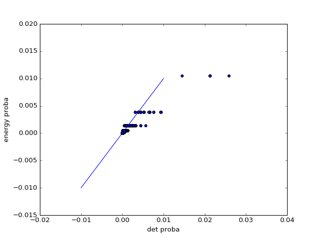
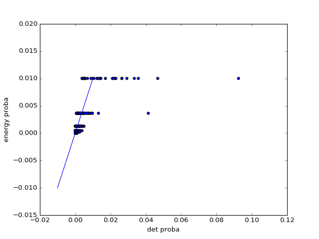
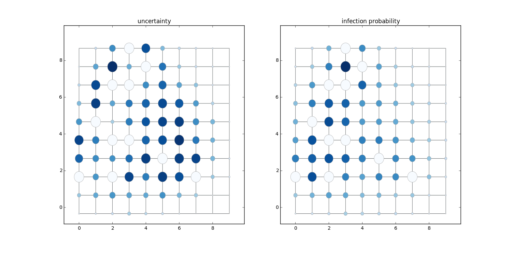
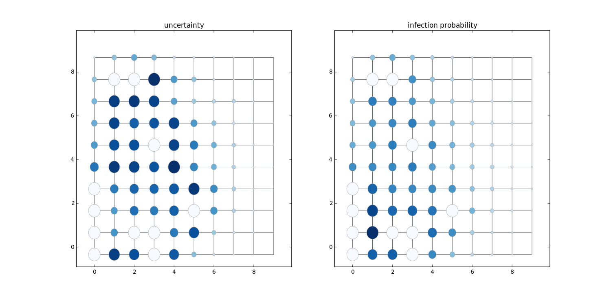
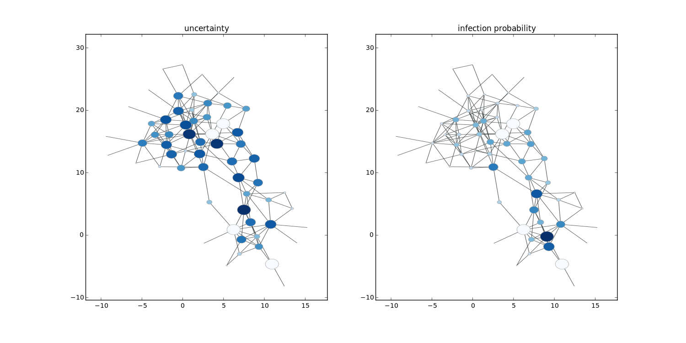
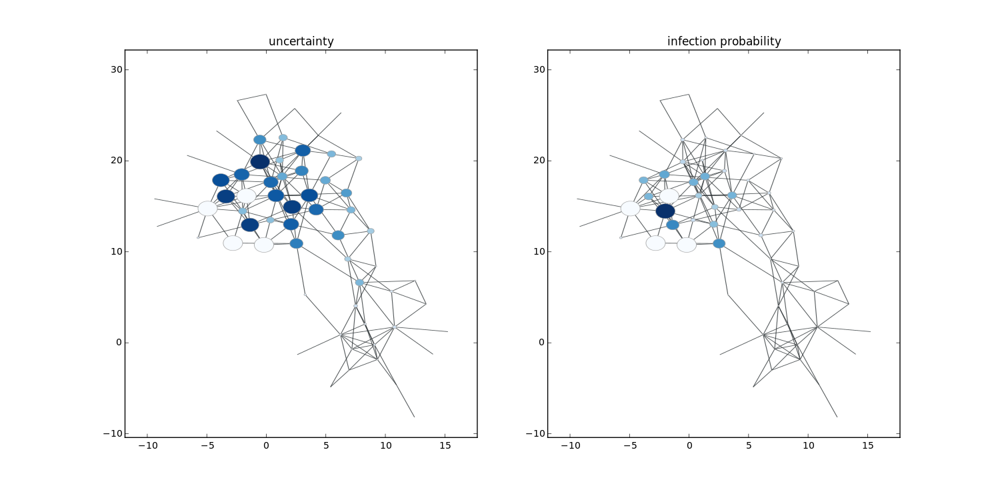
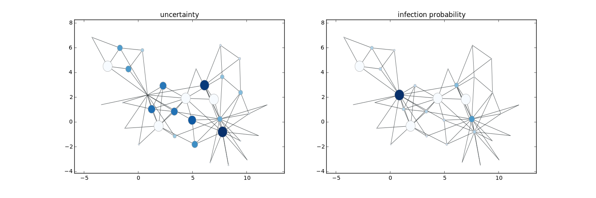
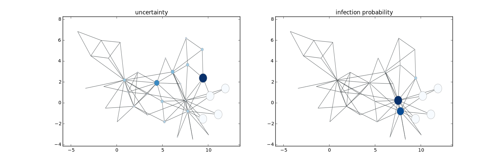
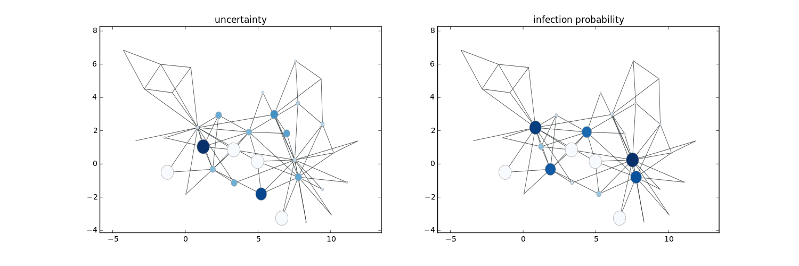
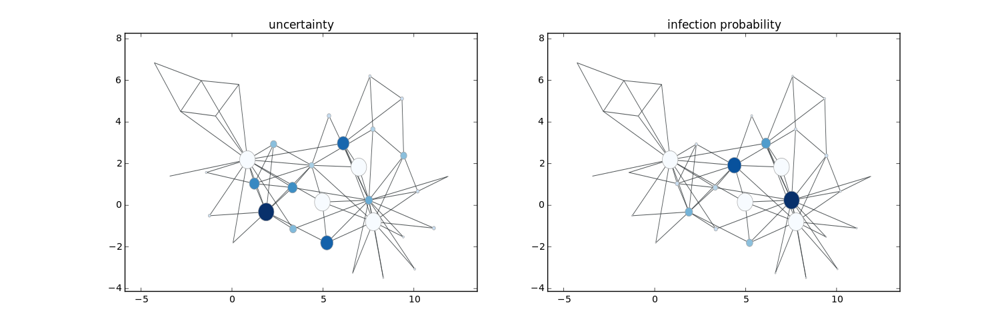

# grid graph

- [square lattice](https://en.wikipedia.org/wiki/Square_lattice)
- `graph_tool.generation.lattice`

# `remove_vertex`

it's not as cheap as I thought. 

for the adjacency list data structure, it takes $`O(V+E)`$ time. 

because, after node removal, the other node ids change and edges should be updated. 


# contracting a graph by nodes

algorithm idea:

denote the nodes to contract as targets

1. remap the nodes such that targets map to node 0, $`map`$
2. the other nodes map to consecutive and unique integers
3. loop through all edges $`(u, v)`$ and use the mapping to get the new edge
   - new edge is $`(map[v], map[v])`$
   - edge weights can be updated similarly

running time:

1. re-map $`O(V)`$
2. add edges $`O(E)`$
3. total $`O(V+E)`$

# determinant of sparse laplacian matrix

- not easy to compute
- [Cholesky decomposition](https://en.wikipedia.org/wiki/Cholesky_decomposition) can be applied
  - decomposes $`A`$ into $`L D L^T`$, where $`L`$ is lower unit triangular matrix and $`D`$ is diagonal matrix
  - determinant is product of diagonal entries in $`D`$
- [more references](https://stackoverflow.com/questions/19107617/how-to-compute-scipy-sparse-matrix-determinant-without-turning-it-to-dense)

# determinant in practice

- det score is usually very large, $`10^{30}`$
  - may suffer from overflow
- \exp score is much smaller, so divided by det score is very  small ($`10^{-45}`$)
  - may suffer from underflow

# plot

- scatter plot marker size: $`s`$ argument

# Sep 14

main finding:

1. distance between distribution on $`\det`$ and $`\exp`$
2. sample expectation

##  tree size histogram

because:

1. $`\exp`$ can be approximated by $`\det`$
2. $`\exp`$ favors small trees

then I expected $`\det`$ sampler also favors small trees. 

however, the tree size histogram does not agree. 

note that even after resampling, tree size does not improve. 


also, determinant based sampler does not give much preference to high determinant score trees. 


## hellinger distance

[def](https://en.wikipedia.org/wiki/Hellinger_distance\#Discrete_distributions)

- karate: `0.2094`
- dolphin: `0.3946`

det vs energy probas: karate




det vs energy probas: karate



observation:

- trees with large `exp` proba tend to have even higher det proba. 
- it might explain why re-sampling give more smaller trees. 

# sep 18

Aris suggests we look at the uncertainty score before doing any evaluation such as precision and recall. 

so there are good and bad examples:

## good examples



- obs: `[22 15 48 53 37 27  2 34 24 39 72]`

## ok example


- obs: `[71 86 47 39 27 76 43 55 34 68 57]`

uncertainty on the lower right part is over-estimated

## bad examples


- obs: `[33 13 20 42 57 51 47 26 15 64 84]`



- obs: `[31  1 21 30 35  2 52 28  3 18  0]`

## dolphin network

0.1 nodes are sampled






## karate network










## new doubt

1. are *small* steiner trees good appriximation to the real cascade?

- does SI model encourage small trees?
   -  if not, is tree diameter a better measure for quality?
- why not use other random tree generator based on the underlying cascade model?

# sep 19: computation bottle neck

```
   111        10           32      3.2      0.0          det_scores = [det_score_of_steiner_tree(st, g)
   112        10     16416741 1641674.1     79.5                        for st in steiner_tree_samples]
```

acutally the bottle neck is computing laplacian

```
    16      1000      3380914   3380.9     89.6      l = laplacian(g, weight=weights)
```


# sep 22

## sampling based inference

gives better result.

notebook: http://193.166.24.212:9999/notebooks/compare_inference_method.ipynb

## our method vs pagerank

gives better result

## why performance drops

first reason: sometimes after the query, the prediction does not change, 

however the queried node (which is a correct prediction) is removed from the prediction, thus making it performance drop. 

second reason: 

- spanning trees should not be re-used . for queried nodes are **not** infected, some old spanning trees are not spanning trees for the new graph. 


# sep 23

possible improvements on visualization:

1. remove uninfected nodes
1. mark also queried nodes (if infected)
1. plot all observed (and infected) nodes during query process
1. color depth for infection probability

why performance go worse?

- bad spanning tree samples? --- increase sample size
  - based only on determinant, there might be some bad trees, shall we just take the **k smallest** trees?
- incorrect threshold for infection probability -- take the top-k nodes?

current evaluation method does not take into account queried nodes. 

thus, if a algorithm just query infected nodes (assume there exists such one), then its performance should increase linearly, this is a good baseline. 

if evaluation only considers observations + queried nodes, we should expect the performance to increase. 

## bad steiner trees: example

I sampled 500 steiner trees on 3 observed nodes. the min steiner tree has size 4. 

below is the tree sizes statistics:

```
count    500.000000
mean      13.414000
std        8.280322
min        4.000000
25%        6.000000
50%       11.500000
75%       19.000000
max       41.000000
dtype: float64
```
- top 25% trees have size <= 6. 

and 10 most common tree sizes and their frequency:

```
[(4, 66), (6, 36), (5, 32), (7, 31), (9, 29), (8, 23), (13, 20), (16, 20), (10, 19), (17, 19)]
```

## improved tree sampling algorithm

let's keep it simple and stupid just take the top 20% trees ranked by the tree size (the smaller the tree, the higher rank)

## sampling steiner trees by personalized random walk. 

this reminds me of sampling the steiner tree by a random walk of personalized vector. 

would it both be faster and give smaller trees in general?

## inference algorithm comparison

(1) sampling using all tree samples vs (2) sampling using top-k tree samples

- same precision
- recall: (1) > (2)

why? threshold=0.5 is bad?

