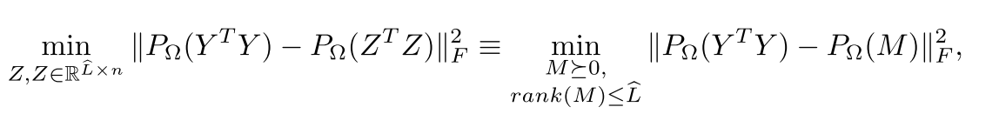
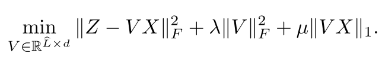

# Sparse Local Embeddings for Extreme Multi-label Classification, NIPS, 2015

given training data $`\{x_i, y_i\}`$

# related work

embedding based method

idea: project label space (dim $`L`$) into a lower dimensional space (dim $`\hat{L}`$), train regressor that predicts the "labels" in the lower dimensional label. 

- $`z = Uy`$ (label in the lower dimensional space)
- train regressor to approximate $`z = V x`$
- prediction: $`U^{'} V x_i`$ where $`U^{'}`$ is the decoding matrix. 

prediction time: $`O(\hat{L}(d+L))`$, $`d`$ is feature dimension
- vs 1-vs-all approach: $`O(dL)`$
- if $`\hat{L}`$is larger than $`d`$, then not worth-worthy

in other words: the training objective is something like $`loss(UY - U^{'}UX)`$

# this paper

## assumption to break

low-rank assumption on label matrix. 

what is a low-rank matrix like in this case?

- related to recovery condition for low rank approximation
- the paper claims "tail" labels cause problem for low rank assumption 
- non-linear manifold can approximate while linear manifold (like low rank approximation) cannot

# objective function

# local embedding 

$`z_i`$ (of lower dimension) for each $`y_i`$ by building knn graph

minimize $`||P_{\Omega}(Y^T Y) - P_{\Omega}(Z^T Z)||^2_F + \lambda ||Z||_1`$

where:

- $`\Omega`$ the set of kNN neighbors, $`(i, j) \in \Omega`$ iff $`i \in N_j`$
- $`(P_{\Omega}(M))_{ij}=M_{ij}`$ if $`(i, j) \in \Omega`$, otherwise $`0`$

# predict local embedding

learn regressor so that 

$`z_i \approx V x_i`$

# together

# training 

non-trivial to directly optimize. it takes:

first, it learns $`Z`$ by considering:

using Singular Value Projection (some details to check)

second, it learns $`V`$ by considering:

using some off-the-shelf convex optimization techniques such as ADMM

## theorem 1

to check

# prediction

KNN-based: 

for each new $`x`$, project it by $`V x`$ and find its *nearest neighbors* from $`z_1, \ldots, z_n`$ (and find $`y`$ and take the average?)

this is slow because it requires a linear scan over all training data points. 

speeding-up: cluster $`(x_i, y_i)`$ into clusters and treat each cluster as one training data point. thus, it reduces training data size. 

also, it uses an ensemble of clustering to fight the following issue:

- clustering is usually unsable for high dim data