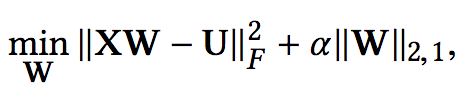
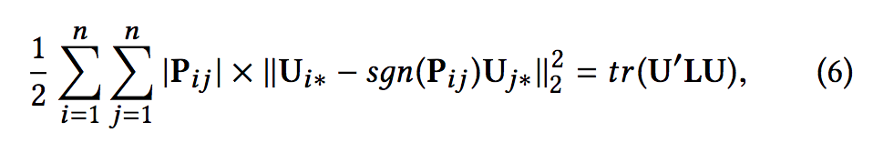
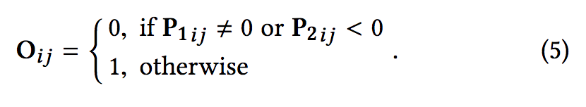

# Unsupervised Feature Selection in Signed Social Networks

## problem in general

how to use:

- social science theories for feature selection
  - homopholy (they call it first-order proximity)
  - balance theory (they call it second-order proximity)
  - (they empirically validated the assumption, regardless of what method they use)
- positive and negative links for feature selection

## notation

- feature set: $`F`$
- feature matrix: $`X`$
- positive link adj matrix: $`A^p`$
- negative link adj matrix: $`A^n`$

**goal**: select the set of most relevant features $`S \subset F`$

# learning obejctive

3 parts:

## latent representations for each users

two matrix factorization over $`A^p`$ and $`A^n`$

note:

- no need for two set of representations
- just two smaller factor interaction terms, $`V^p`$ and $`V^n`$

how to interpret this?

## feature weight matrix

matrix factorization over $`U`$

- like linear regression, but there are multiple target variables

**note**

- in other words, we want the features to model well the node representation
- by learning the weight $`W`$, we know which feature is good for the node representation, the larger the absolute value, the more significant. 

## proximity regularization

$`P`$ is combination of first and second-order proximity

$`P=P_1 + \theta P_2`$, where $`P_2=O \dot A^2`$. 

$`O`$ avoids conflicts

## overall

# training

alternating optimization

# learned

- embedding learning for signed network
- feature selection using matrix factorization
- matrix product of signed matrix `A` gives the friendship and enemy relation in using balance theory. 
